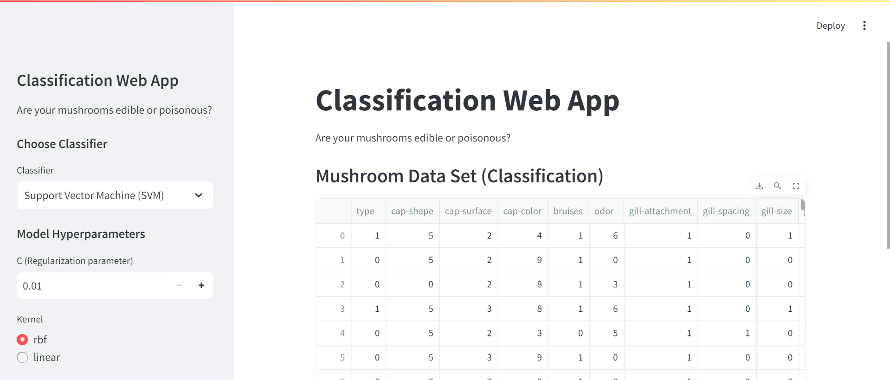
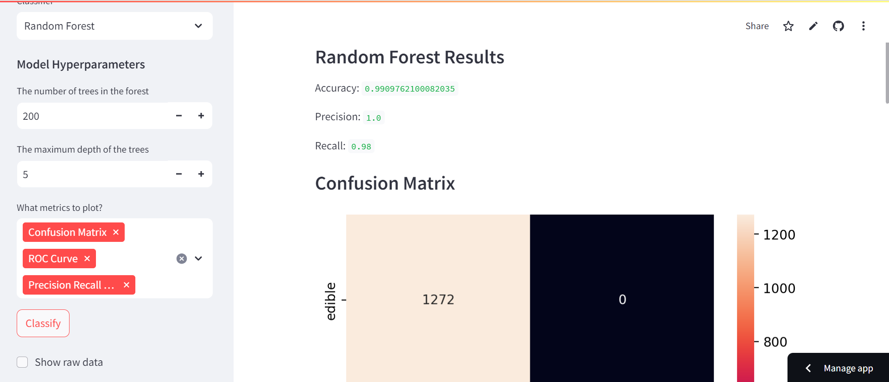

# Binary Classification Web App

## Description

This application is designed to display accuracy metrics of different classification models in order to determine which model is the best classifier of the given data. The data used here is a dataset about mushrooms and the mushrooms are classified by whether they are edible or poisonous.

Using the dropdown menus on the sidebar, the user can pchoose which classification model they would like to use and some of the metrics they would like to view. The results are displayed on the main page once the user clicks the "Classify" button. The user can also view the raw dataset if they wish.

Future development aspirations include adding a functionality for the user to upload their own dataset and adding the ability for multiclass classification modeling.

## Screenshots

## Website
[https://classification-web-app-fwnaxvgw3ufrpeewu6umcp.streamlit.app/](https://classification-web-app-fwnaxvgw3ufrpeewu6umcp.streamlit.app/)

## Resources
- [Streamlit documentation](https://docs.streamlit.io/)
- [Coursera Guided Project, "Build a Machine Learning Web App with Streamlit and Python](https://www.coursera.org/projects/machine-learning-streamlit-python)